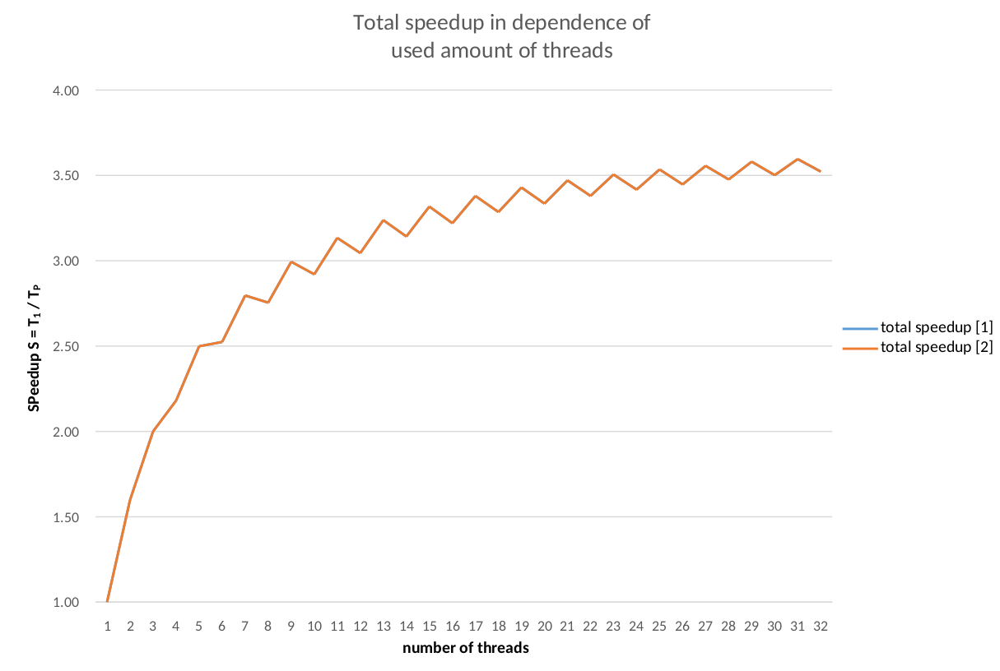

# esp32-BasicParallelProcessing

The [ESP32]() is a dual core microcontroller with a maximum clock speed of 240MHz. If offers the possibility to run and create threads on each core to decrease execution time during a complicated computation in case the problem can be split into sub tasks.  Realtime parallel executuion can only be achieved on dedicated cores, for sure. 

But due to the fact that we only have two cores, there would only be two possible results to compare the execution time available. So i decided to increase the number of threads each core has to handle, too; with interesting results. 

## Definition of the mathematical problem

The main aim of this little project is to focus on a basic computation, which can be splitted into sub tasks.

<p align="center"></p>

This mathematical problem is implemented in the class [Computation.h](https://github.com/josephpal/esp32-BasicParallelProcessing/blob/master/Computation.h) and can be executed with calling the function `compute()`.

```cpp
void Computation::compute() {
	long count = 0;

	for (int i = getLoopOneStart(); i < getLoopOneEnd(); i++) {
		for (int j = getLoopTwoStart(); j < getLoopTwoEnd(); j++) {
			count += i * j;
		}
	}

	/*
	 *  push back the result to the receiver of the queue
	 *  "he" is actually waiting for the result until its transmitted
	 */

	xQueueSend(*queue, &count, portMAX_DELAY);
}
```
It is obvious, based on simple mathematical rules, that the outer sum, which is implemented through the outer for-loop, is divisible by limiting the thresholds, the inner sum unfortunately isn't. So for each part sum it's necessary to calculate the limits, on which each task has to compute their part sum results \[see [Benchmark.h](https://github.com/josephpal/esp32-BasicParallelProcessing/blob/master/Benchmark.h) line 94].

## Benchmark setup

To start the benchmark, we have to include the ``Benchmark.h`` header file, and create an object of it. In the constructor, it is necessary to specify the amount of durations per cycle (for averaging the result), the time to wait until the next benchmark execution will be started and the queue size. 

```cpp
Benchmark bench(1, 1500, 8);

for (int i = 0; i < numOfRunningThreads; ++i) {
	results[i] = new float(bench.performBenchmark(i + 1));
}
```
The queue size represents the maximum number of threads, which can be executed in parallel, because each thread has to return the result to the main thread; this is done by a ESP32 specific [QueueHandle_t](https://techtutorialsx.com/2017/09/13/esp32-arduino-communication-between-tasks-using-freertos-queues/) message passing model between tasks. Keep in mind, that this has an major effect of the available stack or heap size, and of course on the maximum amount of created threads \[for more information about the QueueHandle_t thread communication, see [Benchmark.h](https://github.com/josephpal/esp32-BasicParallelProcessing/blob/master/Benchmark.h) line 99 ff.].

The result of executing the computation with a specific number of threads is the execution time in milliseconds and will be returned as a float value by calling the function `` bench.performBenchmark(numOfThreads))``.

## Evaluation

...

<p align="left"></p>

<p align="left"></p>

